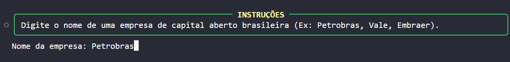
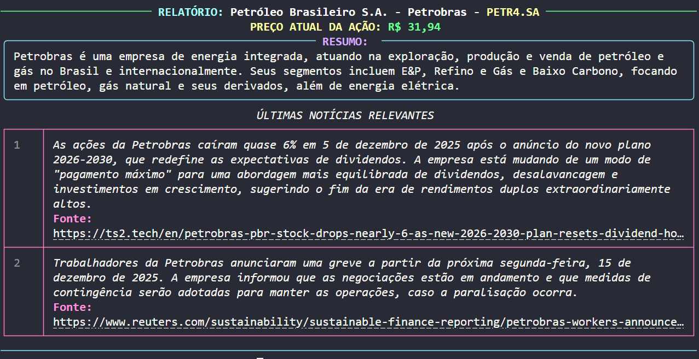

# Desafio Prático - Automatizando Pesquisa Financeira
###### O projeto automatiza a coleta de Resumo, Preço e Notícias para análise financeira.

Ao inserir o nome de uma empresa de capital aberto, o script faz uma busca que retorna:
- Ticker da empresa buscado por uma LLM:
    - **Petrobras** ->  *PETR4*
- Dados da empresa usando o ticker:
    - *Setor da empresa*
    - *Tipo de industria*
    - *Resumo da empresa*
    - *Site da empresa*
    - *Preço atual das ações*
- Noticias recentes envolvendo a empresa.

No final todas as informações sao processadas por uma LLM para gerar um relatório organizado.

<hr>

### Tecnlogias utilizadas:


<br>


**Fluxo de dados** (`main.py`):
1.  **Entrada (Input):** O usuário fornece o nome da empresa. O `input_de_dados` (módulo `terminal.py`) garante a limpeza e padronização.
2.  **Carregamento Visual (UX):** A execução é envolvida pelo `rich.status`, exibindo um carregamento animado enquanto o LangChain processa.
3.  **Processamento Paralelo:** O **`RunnableParallel`** inicia a busca de dados em dois processos simultaneamente:
    * **Dados Financeiros:** Busca do Ticker e Preço (via **yfinance**).
    * **Notícias:** Busca de 2-3 notícias recentes (via **Tavily**).
4.  **Relatório Final:** Os resultados paralelos são compilados no `processamento_final.py`, onde o LLM (*com um parser feito com Pydantic*) gera a saída estruturada (via **Rich**) pelo terminal.

<hr>

### Exemplo visual do fluxo:
<p>O usuário escreve o nome da empresa:</p>



<p>A tela de carregamento é executada enquanto tudo é processado:</p>


<p>No final é mostrado o relatório em uma tela organizada com o ticker (com resumo e descrição da empresa), valor da ação e notícias:</p>
 


<hr>

### Como iniciar:
1. Clone o repositório:
```
git clone https://github.com/Developer-Marcos/sistema-de-pesquisa-web-inteligente.git
```

2. Instale os requisitos:

```
pip install -r requirements.txt
```

3. Adicione um .env e as determinadas chaves de api:
``` python
GEMINI_API_KEY = sua_API_KEY_google
TAVILY_API_KEY = sua_API_KEY_tavily
```

4. Execute o arquivo `main.py`.
